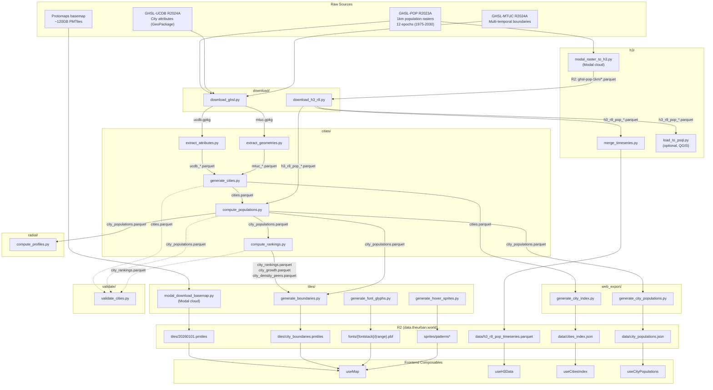

# Data Lineage

Full data flow from raw GHSL sources through the pipeline to R2 and frontend composables.

> All pipeline scripts must be run from the `pipeline/` directory (CWD dependency for standalone scripts using relative `Path("data/...")` paths).

## Pipeline Flow

## R2 Artifact Mapping

| R2 Key | Pipeline Source | Content Type | Web Consumer | Notes |
|--------|---------------|--------------|--------------|-------|
| `tiles/20260101.pmtiles` | `tiles/modal_download_basemap.py` | `application/octet-stream` | `useMap` (basemap style) | ~120GB, updated monthly |
| `tiles/city_boundaries.pmtiles` | `tiles/generate_boundaries.py` | `application/octet-stream` | `useMap` (boundary layer) | Per-epoch features with pop/density/trends |
| `data/h3_r8_pop_timeseries.parquet` | `h3/merge_timeseries.py` | `application/vnd.apache.parquet` | `useH3Data` | Wide format, snappy compression for browser |
| `data/cities_index.json` | `web_export/generate_city_index.py` | `application/json` | `useCitiesIndex` | Static city metadata, search/lookup |
| `data/city_populations.json` | `web_export/generate_city_populations.py` | `application/json` | `useCityPopulations` | Per-epoch pop/area/density |
| `fonts/{fontstack}/{range}.pbf` | `tiles/generate_font_glyphs.py` | `application/x-protobuf` | `useMap` (text labels) | MapLibre glyph protocol |
| `sprites/patterns*` | `tiles/generate_hover_sprites.py` | `image/png`, `application/json` | `useMap` (hover sprites) | Diagonal stripe patterns |

## Citation and Methodology

| Dataset | Source | Methodology | Frontend Consumer |
|---------|--------|-------------|-------------------|
| Population per H3 cell | GHSL-POP R2023A (JRC) | 1km raster resampled to H3 res-8 via modal assignment. Each raster pixel contributes to the H3 cell containing its centroid. | `useH3Data` -> `H3PopulationLayer` |
| City population | GHSL-POP + GHSL-MTUC R2024A | Sum of H3 res-8 cell populations within MTUC city boundary at each epoch. | `useCityPopulations` -> `CityInfoPanel` |
| City area | H3 cell areas | Sum of exact H3 res-8 cell areas (km2) within MTUC boundary. More accurate than bbox approximation. | `useCityPopulations` -> `CityInfoPanel` |
| City density | Derived | City population / city area (per km2). | `useCityPopulations` -> `CityInfoPanel` |
| City boundaries | GHSL-MTUC R2024A | Multi-temporal urban center boundaries, one polygon per city per epoch. | `useMap` -> boundary layer |
| Radial density profiles | GHSL-POP + computed centroids | Bertaud-style: population-weighted centroid, 1km concentric rings out to 50km, density per ring. | TBD |
| City metadata (name, country) | GHSL-UCDB R2024A | Thematic attributes extracted from GeoPackage. ISO country codes via pycountry. | `useCitiesIndex` -> `CitySearch` |
