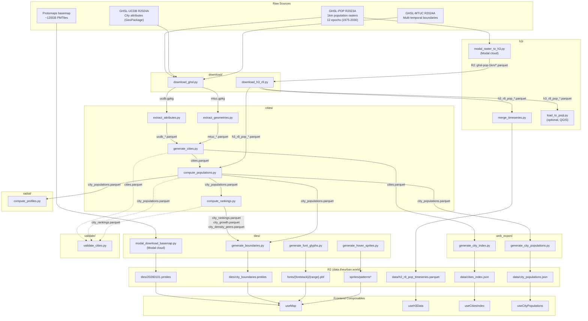

# Reorganize pipeline from numbered scripts to domain directories

## Enhancement Summary

**Deepened on:** 2026-02-08
**Agents used:** kieran-python-reviewer, architecture-strategist, pattern-recognition-specialist, code-simplicity-reviewer, security-sentinel, best-practices-researcher

### Key Improvements
1. **Confirmed import strategy is correct** — `.utils.` → `..utils.` is needed because moving scripts one level deeper changes relative import resolution
2. **Git commit strategy** — separate move-only commits from import-fix commits to preserve `git log --follow` history
3. **Security hardening** — lazy dotenv loading and credential validation in shared r2_upload.py
4. **Simplification option noted** — the plan is comprehensive; a solo dev could defer DATA_LINEAGE.md and r2_upload.py extraction if pressed for time (see Simplification Notes section)

### Key Debates Across Reviewers
- **Import paths**: Python reviewer initially claimed `.utils` wouldn't need changing — verified this is WRONG. Scripts move from `src/script.py` to `src/domain/script.py`, so `.utils` resolves to `src.domain.utils` (doesn't exist). `..utils` correctly resolves to `src.utils`.
- **Directory count**: Simplicity reviewer suggests 4 dirs, architecture reviewer likes 8. Both are valid — 8 gives clearer domain boundaries for future growth but is more overhead now.
- **r2_upload.py**: Security wants hardened validation, simplicity says skip extraction entirely. Middle ground: extract with basic validation, skip the elaborate error handling for now.
- **h3/ naming**: Python reviewer and best-practices researcher both flag package shadowing risk. Keep `h3/` but add a warning comment in `__init__.py`.

## Overview

Replace the numbered flat script convention (`s01_`, `s02a_`, ..., `s99_`) in `pipeline/src/` with domain-grouped directories that match frontend concepts. Create a single `DATA_LINEAGE.md` at the repo root with mermaid diagrams showing the full data flow. Align naming across pipeline, R2 keys, and web composables. Extract duplicated R2 upload logic into a shared module.

This plan implements the decisions documented in `docs/brainstorms/2026-02-08-pipeline-organization-brainstorm.md`.

## Root Cause / Motivation

The current numbered convention has three problems:

1. **Script names are opaque.** `s04a_compute_city_populations.py` requires the developer to decode a numbering scheme to understand its role. In domain directories, `cities/compute_populations.py` communicates intent immediately.

2. **Execution order is baked into filenames.** Adding a new step between s04a and s04b means either inventing awkward names (s04a2) or renumbering. Domain directories decouple ordering from naming -- execution order lives in documentation, not filenames.

3. **Pipeline vocabulary diverges from frontend.** The pipeline says "s09_generate_city_json" while the frontend says "useCitiesIndex". Domain directories can use shared vocabulary (e.g., `web_export/generate_city_index.py` maps directly to `useCitiesIndex`).

## Proposed Solution

### Target directory structure

```
pipeline/src/
  __init__.py              # Package marker (keep existing)
  download/
    __init__.py
    download_ghsl.py       # was s01_download_ghsl.py (ingests from external JRC)
    download_h3_r8.py      # was s03a_download_h3_r8.py (pulls pre-computed from R2)
  cities/
    __init__.py
    extract_attributes.py  # was s02a_extract_city_attributes.py
    extract_geometries.py  # was s02b_extract_city_geometries.py
    generate_cities.py     # was s02c_generate_cities.py
    compute_populations.py # was s04a_compute_city_populations.py
    compute_rankings.py    # was s04b_compute_city_rankings.py
  h3/
    __init__.py
    modal_raster_to_h3.py  # was s03_modal_raster_1km_to_h3_r8.py
    load_to_psql.py        # was s03b_load_h3_r8_to_psql.py
    merge_timeseries.py    # was s08_merge_h3_timeseries.py
  radial/
    __init__.py
    compute_profiles.py    # was s05_compute_radial_profiles.py
  tiles/
    __init__.py
    modal_download_basemap.py  # was s06_modal_download_pmtiles.py
    generate_boundaries.py     # was s07_generate_boundary_pmtiles.py
    generate_font_glyphs.py    # was s10_generate_font_glyphs.py
    generate_hover_sprites.py  # was s11_generate_hover_sprites.py
  web_export/
    __init__.py
    generate_city_index.py       # was s09_generate_city_json.py
    generate_city_populations.py # was s09b_generate_city_populations_json.py
  validate/
    __init__.py
    validate_cities.py     # was s99_validate_cities.py
  explore/
    __init__.py
    app_explore.py         # was app_explore.py (Streamlit)
  utils/                   # Keep existing structure
    __init__.py
    config.py
    progress.py
    geometry_utils.py
    tile_utils.py
    raster_utils.py
    h3_utils.py
    r2_upload.py           # NEW: extracted shared R2 upload logic
    r2_config.py           # Existing (currently unused, will wire up)
```

### Complete script rename mapping

| Old path | New path | CLI framework | R2 upload? |
|----------|----------|--------------|------------|
| `s01_download_ghsl.py` | `download/download_ghsl.py` | click | No |
| `s02a_extract_city_attributes.py` | `cities/extract_attributes.py` | click (group) | No |
| `s02b_extract_city_geometries.py` | `cities/extract_geometries.py` | click | No |
| `s02c_generate_cities.py` | `cities/generate_cities.py` | click | No |
| `s03_modal_raster_1km_to_h3_r8.py` | `h3/modal_raster_to_h3.py` | Modal entrypoint | Yes (Modal secrets) |
| `s03a_download_h3_r8.py` | `download/download_h3_r8.py` | argparse | No (downloads) |
| `s03b_load_h3_r8_to_psql.py` | `h3/load_to_psql.py` | click | No |
| `s04a_compute_city_populations.py` | `cities/compute_populations.py` | click | No |
| `s04b_compute_city_rankings.py` | `cities/compute_rankings.py` | click | No |
| `s05_compute_radial_profiles.py` | `radial/compute_profiles.py` | click | No |
| `s06_modal_download_pmtiles.py` | `tiles/modal_download_basemap.py` | Modal entrypoint | Yes (Modal secrets) |
| `s07_generate_boundary_pmtiles.py` | `tiles/generate_boundaries.py` | argparse | Yes (boto3) |
| `s08_merge_h3_timeseries.py` | `h3/merge_timeseries.py` | argparse | Yes (boto3) |
| `s09_generate_city_json.py` | `web_export/generate_city_index.py` | argparse | Yes (boto3) |
| `s09b_generate_city_populations_json.py` | `web_export/generate_city_populations.py` | argparse | Yes (boto3) |
| `s10_generate_font_glyphs.py` | `tiles/generate_font_glyphs.py` | argparse | Yes (rclone) |
| `s11_export_web_formats.py` | *(delete -- empty stub)* | -- | -- |
| `s11_generate_hover_sprites.py` | `tiles/generate_hover_sprites.py` | argparse | Yes (boto3) |
| `s99_validate_cities.py` | `validate/validate_cities.py` | click | No |
| `app_explore.py` | `explore/app_explore.py` | streamlit | No |

### Import relationship changes

**Scripts with relative imports that must change:**

These 8 scripts import from `.utils.*` and their import paths must be updated to account for the new directory depth:

| Script (new location) | Current import | New import |
|----------------------|----------------|------------|
| `download/download_ghsl.py` | `from .utils.config import ...` | `from ..utils.config import ...` |
| `download/download_ghsl.py` | `from .utils.progress import ...` | `from ..utils.progress import ...` |
| `cities/extract_attributes.py` | `from .utils.config import ...` | `from ..utils.config import ...` |
| `cities/extract_geometries.py` | `from .utils.config import ...` | `from ..utils.config import ...` |
| `cities/extract_geometries.py` | `from .utils.geometry_utils import ...` | `from ..utils.geometry_utils import ...` |
| `cities/generate_cities.py` | `from .utils.config import ...` | `from ..utils.config import ...` |
| `cities/generate_cities.py` | `from .utils.tile_utils import ...` | `from ..utils.tile_utils import ...` |
| `cities/compute_populations.py` | `from .utils.config import ...` | `from ..utils.config import ...` |
| `cities/compute_rankings.py` | `from .utils.config import ...` | `from ..utils.config import ...` |
| `radial/compute_profiles.py` | `from .utils.config import ...` | `from ..utils.config import ...` |
| `radial/compute_profiles.py` | `from .utils.h3_utils import ...` | `from ..utils.h3_utils import ...` |
| `validate/validate_cities.py` | `from .utils.config import ...` | `from ..utils.config import ...` |

**Scripts with NO relative imports (standalone):** These move as-is with no import changes:
- `h3/modal_raster_to_h3.py` (Modal -- fully self-contained)
- `download/download_h3_r8.py` (standalone argparse + dotenv)
- `h3/load_to_psql.py` (standalone click + dotenv)
- `tiles/modal_download_basemap.py` (Modal -- fully self-contained)
- `tiles/generate_boundaries.py` (standalone argparse + dotenv)
- `h3/merge_timeseries.py` (standalone argparse + dotenv)
- `web_export/generate_city_index.py` (standalone argparse + dotenv)
- `web_export/generate_city_populations.py` (standalone argparse + dotenv)
- `tiles/generate_font_glyphs.py` (standalone argparse + dotenv)
- `tiles/generate_hover_sprites.py` (standalone argparse + dotenv)
- `explore/app_explore.py` (standalone streamlit)

### Shared R2 upload extraction

Currently 6 scripts (s07, s08, s09, s09b, s10, s11_hover) each contain their own `upload_to_r2()` function with identical boto3 boilerplate. An `r2_config.py` exists in utils but is unused.

Create `pipeline/src/utils/r2_upload.py`:

```python
"""
Shared R2 upload utility.

Consolidates the duplicated upload_to_r2() pattern from 6+ scripts.
Reads R2 credentials from environment variables (via .env file).

Usage:
    from ..utils.r2_upload import upload_to_r2
    upload_to_r2(local_path, r2_key, content_type="application/json")
"""

from __future__ import annotations

import os
from pathlib import Path

import boto3
from dotenv import load_dotenv

# Lazy dotenv loading — only loads on first use, not at import time.
# This prevents test environment pollution when importing the module.
_dotenv_loaded = False


def _ensure_env_loaded() -> None:
    """Load .env file if not already loaded."""
    global _dotenv_loaded
    if not _dotenv_loaded:
        load_dotenv()
        _dotenv_loaded = True


def get_r2_client():
    """Create boto3 S3 client configured for R2."""
    _ensure_env_loaded()

    required = ["R2_ENDPOINT_URL", "R2_ACCESS_KEY_ID", "R2_SECRET_ACCESS_KEY"]
    missing = [k for k in required if not os.environ.get(k)]
    if missing:
        raise ValueError(
            f"Missing R2 credentials: {', '.join(missing)}. "
            "Create a .env file based on .env.example"
        )

    return boto3.client(
        "s3",
        endpoint_url=os.environ["R2_ENDPOINT_URL"],
        aws_access_key_id=os.environ["R2_ACCESS_KEY_ID"],
        aws_secret_access_key=os.environ["R2_SECRET_ACCESS_KEY"],
    )


def upload_to_r2(
    local_path: Path,
    r2_key: str,
    content_type: str = "application/octet-stream",
    bucket_name: str | None = None,
) -> str:
    """Upload a file to R2.

    Args:
        local_path: Path to local file
        r2_key: Destination key in R2
        content_type: MIME type for the upload
        bucket_name: Override bucket (defaults to R2_BUCKET_NAME env var)

    Returns:
        S3 URI of uploaded file
    """
    _ensure_env_loaded()
    bucket = bucket_name or os.environ.get("R2_BUCKET_NAME")
    if not bucket:
        raise ValueError("R2_BUCKET_NAME not set in environment")

    s3 = get_r2_client()

    file_size = local_path.stat().st_size
    if file_size < 1024 ** 2:
        size_str = f"{file_size / 1024:.1f} KB"
    else:
        size_str = f"{file_size / (1024 ** 2):.1f} MB"
    print(f"  Uploading {local_path.name} ({size_str}) -> {r2_key}")

    s3.upload_file(
        str(local_path),
        bucket,
        r2_key,
        ExtraArgs={"ContentType": content_type},
    )

    uri = f"s3://{bucket}/{r2_key}"
    print(f"  Uploaded to {uri}")
    return uri
```

**Research insight (security):** The original version called `load_dotenv()` at import time and used bare `os.environ["KEY"]` (crashes with unhelpful `KeyError`). The improved version uses lazy loading and validates credentials before use. The existing `r2_config.py` has a latent `NameError` bug on line 103 and is unused — leave it for now, do not depend on it.

Then replace the inline `upload_to_r2()` in each of the 6 standalone scripts with an import. Note: Modal scripts (s03, s06) keep their own upload logic because they run in isolated containers that cannot import local modules.

### pyproject.toml entry points

The current `[project.scripts]` section references 10 scripts that no longer exist. Replace entirely:

```toml
[project.scripts]
# Download domain
download-ghsl = "src.download.download_ghsl:main"
download-h3 = "src.download.download_h3_r8:main"

# Cities domain
extract-attributes = "src.cities.extract_attributes:cli"
extract-geometries = "src.cities.extract_geometries:main"
generate-cities = "src.cities.generate_cities:main"
compute-populations = "src.cities.compute_populations:main"
compute-rankings = "src.cities.compute_rankings:main"

# H3 domain
load-h3-psql = "src.h3.load_to_psql:main"
merge-h3-timeseries = "src.h3.merge_timeseries:main"

# Radial domain
compute-radial = "src.radial.compute_profiles:main"

# Tiles domain
generate-boundaries = "src.tiles.generate_boundaries:main"
generate-fonts = "src.tiles.generate_font_glyphs:main"
generate-sprites = "src.tiles.generate_hover_sprites:main"

# Web export domain
generate-city-index = "src.web_export.generate_city_index:main"
generate-city-populations = "src.web_export.generate_city_populations:main"

# Validate
validate = "src.validate.validate_cities:main"
```

Note: Modal scripts (h3/modal_raster_to_h3.py, tiles/modal_download_basemap.py) are not included because they are invoked via `modal run`, not as Python entry points.

**Research insight (pattern recognition):** The CLI framework split is intentional and should NOT be standardized:
- **click** scripts (8): Import from `utils/config.py`, use shared configuration, support subcommands — these are internal pipeline steps
- **argparse** scripts (7): Standalone, use `Path("data/...")` directly, have simple `--local` flags — these are final output/export steps
- **Modal** scripts (2): Cloud execution, fully self-contained — cannot use local imports

The verb naming within domains is already consistent:
- `extract_` = raw data extraction from source formats
- `compute_` = analytical calculations
- `generate_` = output file creation
- `download_` = network data retrieval

### `uv run -m` invocation update

The current convention is `uv run python -m src.s09_generate_city_json`. After reorganization:

```bash
# Old
uv run python -m src.s09_generate_city_json --local
uv run python -m src.s99_validate_cities -v

# New
uv run python -m src.web_export.generate_city_index --local
uv run python -m src.validate.validate_cities -v
```

### CLAUDE.md updates

**`pipeline/CLAUDE.md`** must be updated to reflect the new module paths:

```markdown
# In `/pipeline`
- All Python commands should be run with `uv run`
- Use DuckDB cli for data exploration: `duckdb`

## Running pipeline scripts

Scripts are organized by domain under `src/`:

```bash
# Download
uv run python -m src.download.download_ghsl

# Cities
uv run python -m src.cities.extract_attributes extract
uv run python -m src.cities.compute_populations

# H3
uv run python -m src.h3.merge_timeseries --local

# Radial
uv run python -m src.radial.compute_profiles

# Tiles
uv run python -m src.tiles.generate_boundaries --local
uv run python -m src.tiles.generate_font_glyphs --local

# Web export (JSON for frontend)
uv run python -m src.web_export.generate_city_index --local
uv run python -m src.web_export.generate_city_populations --local

# Validate
uv run python -m src.validate.validate_cities -v
```

## Validation schema reference

```
cities.parquet           -> CitySchema          (in src/validate/validate_cities.py)
city_populations.parquet -> CityPopulationSchema
city_rankings.parquet    -> CityRankingSchema
city_growth.parquet      -> CityGrowthSchema
city_density_peers.parquet -> CityDensityPeersSchema
```
```

## DATA_LINEAGE.md

Create `DATA_LINEAGE.md` at the repo root with three sections:

### Section 1: Full pipeline flow diagram (Mermaid)



### Section 2: R2 artifact mapping table

| R2 Key | Pipeline Source | Content Type | Web Consumer | Notes |
|--------|---------------|--------------|--------------|-------|
| `tiles/20260101.pmtiles` | `tiles/modal_download_basemap.py` | `application/octet-stream` | `useMap` (basemap style) | ~120GB, updated monthly |
| `tiles/city_boundaries.pmtiles` | `tiles/generate_boundaries.py` | `application/octet-stream` | `useMap` (boundary layer) | Per-epoch features with pop/density/trends |
| `data/h3_r8_pop_timeseries.parquet` | `h3/merge_timeseries.py` | `application/vnd.apache.parquet` | `useH3Data` | Wide format, snappy compression for browser |
| `data/cities_index.json` | `web_export/generate_city_index.py` | `application/json` | `useCitiesIndex` | Static city metadata, search/lookup |
| `data/city_populations.json` | `web_export/generate_city_populations.py` | `application/json` | `useCityPopulations` | Per-epoch pop/area/density |
| `fonts/{fontstack}/{range}.pbf` | `tiles/generate_font_glyphs.py` | `application/x-protobuf` | `useMap` (text labels) | MapLibre glyph protocol |
| `sprites/patterns*` | `tiles/generate_hover_sprites.py` | `image/png`, `application/json` | `useMap` (hover sprites) | Diagonal stripe patterns |

### Section 3: Citation and methodology reference

| Dataset | Source | Methodology | Frontend Consumer |
|---------|--------|-------------|-------------------|
| Population per H3 cell | GHSL-POP R2023A (JRC) | 1km raster resampled to H3 res-8 via modal assignment. Each raster pixel contributes to the H3 cell containing its centroid. | `useH3Data` -> `H3PopulationLayer` |
| City population | GHSL-POP + GHSL-MTUC R2024A | Sum of H3 res-8 cell populations within MTUC city boundary at each epoch. | `useCityPopulations` -> `CityInfoPanel` |
| City area | H3 cell areas | Sum of exact H3 res-8 cell areas (km2) within MTUC boundary. More accurate than bbox approximation. | `useCityPopulations` -> `CityInfoPanel` |
| City density | Derived | City population / city area (per km2). | `useCityPopulations` -> `CityInfoPanel` |
| City boundaries | GHSL-MTUC R2024A | Multi-temporal urban center boundaries, one polygon per city per epoch. | `useMap` -> boundary layer |
| Radial density profiles | GHSL-POP + computed centroids | Bertaud-style: population-weighted centroid, 1km concentric rings out to 50km, density per ring. | TBD |
| City metadata (name, country) | GHSL-UCDB R2024A | Thematic attributes extracted from GeoPackage. ISO country codes via pycountry. | `useCitiesIndex` -> `CitySearch` |

## Acceptance Criteria

- [x] All scripts moved to domain directories with descriptive names (no `s01_` prefixes)
- [x] All relative imports updated from `.utils.*` to `..utils.*`
- [x] Empty stub `s11_export_web_formats.py` deleted
- [x] Shared `r2_upload.py` module created in `utils/`
- [x] At least the 2 `web_export/` scripts use shared `r2_upload` (remaining scripts can be migrated incrementally)
- [x] `pyproject.toml` entry points updated to new module paths
- [x] `uv lock` run after pyproject.toml changes
- [x] All `uv run python -m src.<domain>.<script>` invocations work
- [x] `pipeline/CLAUDE.md` updated with new paths and domain-based run instructions
- [x] `DATA_LINEAGE.md` created at repo root with mermaid diagram, R2 mapping table, and citation reference
- [ ] `uv run python -m src.validate.validate_cities` passes (confirms imports and data paths still work)
- [x] Each domain `__init__.py` created (can be empty -- especially `h3/__init__.py` to avoid shadowing the `h3` package)
- [x] No old `s*_` scripts remain in `pipeline/src/` root
- [x] All docstring `Usage:` lines updated to new module paths (including `modal run` paths)
- [x] Cross-script error messages updated to reference new script paths
- [x] `app_explore.py` path resolution fixed for new directory depth
- [x] Stale `pipeline/GHSL_PIPELINE.md` deleted (superseded by `DATA_LINEAGE.md`)
- [x] `pipeline/README.md` updated with new directory structure and script names

## Implementation

### Phase 1: Scaffold and move standalone scripts

These scripts have zero relative imports and can be moved without any code changes (except `app_explore.py` — see note).

**Steps:**
1. Create domain directories with empty `__init__.py` files
2. Move the 11 standalone scripts (git mv preserves history):

```bash
# Create directories
mkdir -p pipeline/src/{download,cities,h3,radial,tiles,web_export,validate,explore}
touch pipeline/src/{download,cities,h3,radial,tiles,web_export,validate,explore}/__init__.py

# Move standalone scripts (no import changes needed)
git mv pipeline/src/s03_modal_raster_1km_to_h3_r8.py pipeline/src/h3/modal_raster_to_h3.py
git mv pipeline/src/s03a_download_h3_r8.py pipeline/src/download/download_h3_r8.py
git mv pipeline/src/s03b_load_h3_r8_to_psql.py pipeline/src/h3/load_to_psql.py
git mv pipeline/src/s06_modal_download_pmtiles.py pipeline/src/tiles/modal_download_basemap.py
git mv pipeline/src/s07_generate_boundary_pmtiles.py pipeline/src/tiles/generate_boundaries.py
git mv pipeline/src/s08_merge_h3_timeseries.py pipeline/src/h3/merge_timeseries.py
git mv pipeline/src/s09_generate_city_json.py pipeline/src/web_export/generate_city_index.py
git mv pipeline/src/s09b_generate_city_populations_json.py pipeline/src/web_export/generate_city_populations.py
git mv pipeline/src/s10_generate_font_glyphs.py pipeline/src/tiles/generate_font_glyphs.py
git mv pipeline/src/s11_generate_hover_sprites.py pipeline/src/tiles/generate_hover_sprites.py
git mv pipeline/src/app_explore.py pipeline/src/explore/app_explore.py
```

3. Delete the empty stub:

```bash
git rm pipeline/src/s11_export_web_formats.py
```

4. **Fix `app_explore.py` path resolution.** Line 20 uses `Path(__file__).parent.parent / "data"` which assumed the script was at `src/app_explore.py`. After moving to `src/explore/app_explore.py`, this resolves to `src/data/` instead of `pipeline/data/`. Fix by adding one more `.parent`:

```python
# Before (line 20):
DATA_DIR = Path(__file__).parent.parent / "data" / "processed" / "cities"
# After:
DATA_DIR = Path(__file__).parent.parent.parent / "data" / "processed" / "cities"
```

Also update the two `st.info()` messages that reference `src.s99_validate_cities` to use `src.validate.validate_cities`.

5. Verify standalone scripts run:

```bash
uv run python -m src.web_export.generate_city_index --local
uv run python -m src.web_export.generate_city_populations --local
```

### Phase 2: Move scripts with relative imports

These 8 scripts import from `.utils.*` and need import path updates. Also update cross-script error messages in 3 scripts.

**Steps for each script:**
1. `git mv` to new location
2. Update all `.utils.` imports to `..utils.`
3. Update any cross-script error messages referencing old script names
4. Verify with `uv run python -m src.<domain>.<script> --help`

```bash
# download/
git mv pipeline/src/s01_download_ghsl.py pipeline/src/download/download_ghsl.py
# Update: from .utils.config -> from ..utils.config
# Update: from .utils.progress -> from ..utils.progress

# cities/
git mv pipeline/src/s02a_extract_city_attributes.py pipeline/src/cities/extract_attributes.py
git mv pipeline/src/s02b_extract_city_geometries.py pipeline/src/cities/extract_geometries.py
git mv pipeline/src/s02c_generate_cities.py pipeline/src/cities/generate_cities.py
git mv pipeline/src/s04a_compute_city_populations.py pipeline/src/cities/compute_populations.py
git mv pipeline/src/s04b_compute_city_rankings.py pipeline/src/cities/compute_rankings.py
# Update all: from .utils.config -> from ..utils.config
# Update cities/extract_geometries.py: from .utils.geometry_utils -> from ..utils.geometry_utils
# Update cities/generate_cities.py: from .utils.tile_utils -> from ..utils.tile_utils

# radial/
git mv pipeline/src/s05_compute_radial_profiles.py pipeline/src/radial/compute_profiles.py
# Update: from .utils.config -> from ..utils.config
# Update: from .utils.h3_utils -> from ..utils.h3_utils

# validate/
git mv pipeline/src/s99_validate_cities.py pipeline/src/validate/validate_cities.py
# Update: from .utils.config -> from ..utils.config
```

**Cross-script error message updates (do alongside the moves):**
- `cities/extract_geometries.py` lines 76, 152: `"Run s01_download_ghsl first"` → `"Run download/download_ghsl first"`
- `h3/modal_raster_to_h3.py` line 466: `"Run 'uv run python -m src.s02b_extract_city_geometries' first"` → `"Run 'uv run python -m src.cities.extract_geometries' first"`

### Phase 3: Extract shared R2 upload

1. Create `pipeline/src/utils/r2_upload.py` (see implementation above). Note: this reads env vars directly via `os.environ`, it does NOT use the existing `r2_config.py` (which has a latent `_PROJECT_ROOT` NameError bug). The existing `r2_config.py` remains unused for now.
2. Update `web_export/generate_city_index.py` and `web_export/generate_city_populations.py` to use the shared module
3. Optionally update remaining scripts (`tiles/generate_boundaries.py`, `h3/merge_timeseries.py`, `tiles/generate_hover_sprites.py`) -- this can be incremental
4. Note: `download/download_h3_r8.py` has its own `get_r2_client()` for *downloading* from R2. Consider extracting to a shared `utils/r2.py` in a future pass, but not required for this refactor.

### Phase 4: Update pyproject.toml, CLAUDE.md, and docs

1. Replace `[project.scripts]` section with new domain-based entry points
2. Update `[tool.hatch.build.targets.wheel]` packages list if needed (currently `packages = ["src"]` should still work since `src/` is the package root)
3. Run `cd pipeline && uv lock` to regenerate lock file after pyproject.toml changes
4. Update `pipeline/CLAUDE.md` with new paths, domain-based run instructions, and Streamlit invocation path (`uv run streamlit run src/explore/app_explore.py`)
5. Update docstring `Usage:` lines in all moved scripts to reflect new module paths. This includes `modal run` paths in Modal scripts (e.g., `modal run src/h3/modal_raster_to_h3.py`)
6. Delete stale `pipeline/GHSL_PIPELINE.md` (superseded by `DATA_LINEAGE.md`): `git rm pipeline/GHSL_PIPELINE.md`
7. Update `pipeline/README.md` with new directory structure, script names, and remove references to nonexistent Makefile targets

### Phase 5: Create DATA_LINEAGE.md

1. Create `DATA_LINEAGE.md` at repo root with all three sections (mermaid diagram, R2 mapping, citations)
2. Include a note that all pipeline scripts must be run from the `pipeline/` directory (CWD dependency for standalone scripts using relative `Path("data/...")` paths)
3. Verify mermaid renders on GitHub by pushing to a branch

### Git Commit Strategy

**Research insight:** Git's rename detection works best when moves are isolated from content changes. Separate move-only commits from import-fix commits so `git log --follow` reliably tracks history.

Recommended commit sequence:
1. **Commit 1 (scaffold):** Create domain directories + `__init__.py` files
2. **Commit 2 (move standalone):** `git mv` the 11 standalone scripts — no code changes
3. **Commit 3 (move + fix imports):** `git mv` the 8 scripts with imports, then fix `.utils.` → `..utils.` in a second commit OR same commit (acceptable since the content change is minimal — just import paths)
4. **Commit 4 (shared module):** Create `r2_upload.py` and update consuming scripts
5. **Commit 5 (docs):** Update pyproject.toml, CLAUDE.md, README, delete GHSL_PIPELINE.md
6. **Commit 6 (lineage):** Create DATA_LINEAGE.md

**Important:** Use explicit `git add` with file paths — never `git add .` or `git add -A` during a large reorganization. This prevents accidentally staging `.env` or other sensitive files.

## Context

### Files to create
- `pipeline/src/download/__init__.py`
- `pipeline/src/cities/__init__.py`
- `pipeline/src/h3/__init__.py`
- `pipeline/src/radial/__init__.py`
- `pipeline/src/tiles/__init__.py`
- `pipeline/src/web_export/__init__.py`
- `pipeline/src/validate/__init__.py`
- `pipeline/src/explore/__init__.py`
- `pipeline/src/utils/r2_upload.py` -- shared R2 upload logic
- `DATA_LINEAGE.md` -- repo root lineage document

### Files to move (git mv)
- All 20 scripts listed in the rename mapping table above

### Files to modify
- 8 scripts with relative import updates (`.utils.` -> `..utils.`)
- `explore/app_explore.py` -- fix `Path(__file__)` resolution and stale script references
- 3 scripts with cross-script error messages referencing old names
- ~18 scripts with docstring `Usage:` line updates
- `pipeline/pyproject.toml` -- entry points section
- `pipeline/CLAUDE.md` -- run instructions, schema reference paths, and Streamlit path
- `pipeline/README.md` -- directory structure and script names

### Files to delete
- `pipeline/src/s11_export_web_formats.py` (empty stub)
- `pipeline/GHSL_PIPELINE.md` (stale, superseded by `DATA_LINEAGE.md`)

### Files that need NO changes
- `pipeline/src/utils/config.py` -- paths are computed from `__file__`, will still resolve correctly
- `pipeline/src/utils/*.py` -- all other utils remain in place
- `web/` -- no frontend changes needed
- `pipeline/docker-compose.yml` -- infrastructure unchanged
- `pipeline/Dockerfile.postgis` -- infrastructure unchanged

### Risk notes

1. **`config.py` path resolution:** `PROJECT_ROOT` is computed as `Path(__file__).parent.parent.parent`. With utils staying at `pipeline/src/utils/config.py`, this still resolves to `pipeline/`. No change needed.

2. **Modal scripts are isolated:** `h3/modal_raster_to_h3.py` and `tiles/modal_download_basemap.py` define their own container images. They do not import from `src/utils/` and cannot -- the local package is not available inside Modal containers. These scripts move as-is.

3. **hatch build:** The `[tool.hatch.build.targets.wheel]` setting `packages = ["src"]` should continue to work because `src/` remains the package root. The domain directories become sub-packages.

4. **Git history:** Using `git mv` preserves file history. Each move should be a separate commit or batch of related moves so history is clean.

5. **`h3/` directory name vs `h3` package:** The `src/h3/` directory shares a name with the `h3` Python package (a dependency). Keep `h3/__init__.py` empty to avoid shadowing. Scripts inside `src/h3/` can still `import h3` and it will resolve to the installed package (not the sibling package).

6. **`app_explore.py` path resolution:** Uses `Path(__file__).parent.parent` which must be updated to `.parent.parent.parent` after moving one directory deeper. This is the only script (besides those using `utils/config.py`) that resolves paths from `__file__`.

7. **CWD dependency:** Standalone scripts using relative `Path("data/...")` paths (download_h3_r8, merge_timeseries, generate_font_glyphs, generate_hover_sprites, etc.) require CWD to be `pipeline/`. This is an existing limitation, not a regression from the move. Document in CLAUDE.md and DATA_LINEAGE.md.

## Simplification Notes

The simplicity reviewer flagged this plan as potentially over-engineered for a solo dev. Here's a minimal viable version if you want to move faster:

**Minimum viable refactor (1-2 hours):**
1. Create domain directories, `git mv` all scripts, fix imports — one session
2. Update CLAUDE.md and README
3. Skip: DATA_LINEAGE.md, r2_upload.py extraction, pyproject.toml entry points

**What you'd lose:** Lineage documentation (add later when needed), DRY upload code (8 lines duplicated isn't painful), entry point commands (you use `python -m` anyway).

**What you'd keep:** The core value — clear directory structure, descriptive names, frontend vocabulary alignment.

**Recommendation:** The full plan is the better investment for a project you expect to grow. But if time is tight, the minimal version still delivers 80% of the value.

## Research Insights

### Python Packaging
- **Import resolution confirmed:** `.utils.` → `..utils.` is correct. Scripts move from `src/<script>.py` (where `.utils` resolves to `src.utils`) to `src/<domain>/<script>.py` (where `.utils` would resolve to `src.<domain>.utils`, which doesn't exist). `..utils` correctly traverses up to `src.utils`.
- **h3/ shadowing:** The `h3` directory name conflicts with the installed `h3` package. Keep `h3/__init__.py` empty. If this causes issues in practice, rename to `h3_processing/`.
- **Entry points:** Current pyproject.toml entry points are all stale. The `python -m` invocation pattern works fine — entry points are optional convenience.

### Git History
- **Best practice:** Separate move-only commits from content-change commits. Git's rename detection gets confused when >20% of a file's content changes alongside a move. Import path fixes are minimal enough to combine with moves if preferred.
- **Verify with:** `git log --follow -- <new_path>` after each batch of moves.

### Data Lineage
- **Mermaid is the right tool:** GitHub renders it natively, VS Code has live preview extensions, widely adopted in data engineering. No external tooling needed.
- **Multi-level diagrams:** Industry practice is to have high-level overview + domain-specific detail. The current plan covers the high-level; domain-level detail can be added later.

### Security
- **Lazy dotenv loading:** Shared modules should not call `load_dotenv()` at import time — it can pollute test environments and cause order-dependent behavior. Use lazy loading pattern.
- **Credential validation:** `os.environ["KEY"]` without `.get()` produces unhelpful `KeyError` on missing credentials. Always validate before use.
- **Git safety during refactor:** Use explicit `git add <file>` instead of `git add .` when moving many files to avoid accidentally staging `.env`.

## References

- Brainstorm: `docs/brainstorms/2026-02-08-pipeline-organization-brainstorm.md`
- Pipeline config: `pipeline/src/utils/config.py` (PROJECT_ROOT resolution at line 23)
- Unused R2 config: `pipeline/src/utils/r2_config.py` (has latent NameError bug on line 103)
- Frontend composable URLs: `web/app/composables/useMap.ts`, `useCitiesIndex.ts`, `useH3Data.ts`, `useCityPopulations.ts`
- Stale entry points: `pipeline/pyproject.toml:50-60`
- Validation framework: `pipeline/src/s99_validate_cities.py`
- Pipeline CLAUDE.md: `pipeline/CLAUDE.md`

### External References
- [Dagster — Organizing your project](https://docs.dagster.io/guides/build/projects/structuring-your-dagster-project) — domain-grouped vs technology-grouped structures
- [Real Python — Absolute vs Relative Imports](https://realpython.com/absolute-vs-relative-python-imports/) — when to use `..` relative imports
- [Python Packaging User Guide — Namespace packages](https://packaging.python.org/guides/packaging-namespace-packages/) — package shadowing risks
- [Git rename detection](https://sqlpey.com/git/effective-git-strategies-for-preserving-history/) — separate moves from content changes
